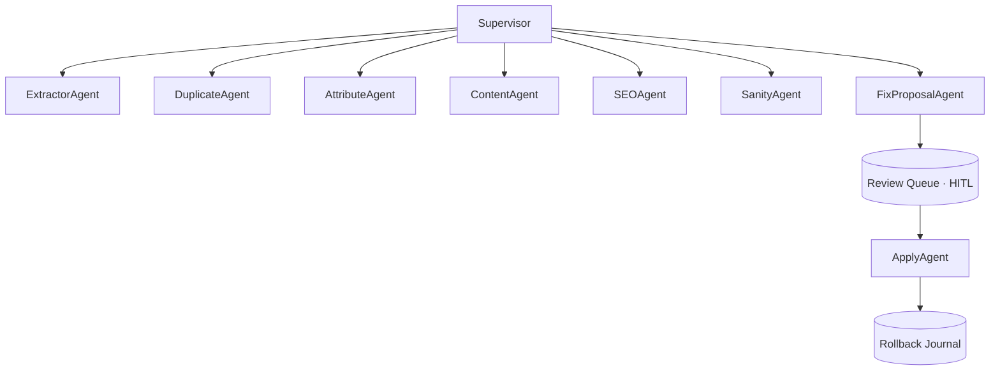

# CatalogGuard AI

> A LangGraph multi-agent system that audits a live **Magento 2 / Adobe Commerce** catalog,
> finds data-quality problems across 5 dimensions, and auto-fixes them with **human-in-the-loop
> approval** and a one-command rollback journal.

[]()
[]()
[](LICENSE)

CatalogGuard AI never writes to your store without explicit approval. Every applied change is
journaled so any fix batch can be reverted with a single command.

## What it audits

| Dimension | Examples |
|-----------|----------|
| **Duplicates** | Exact & near-duplicate products via embedding similarity (ChromaDB) |
| **Attributes** | Required attrs empty, wrong types, placeholders ("TBD"), missing images/weight |
| **Content** | Descriptions too short, keyword-stuffed, copied from feeds, HTML corruption |
| **SEO** | Missing/duplicate meta, length violations, missing alt text, thin content |
| **Sanity** | Zero categories, price=0 on enabled, special>regular, enabled+zero-stock |

## Architecture



Rule-based checks run **before** any LLM call (never spend a token on what a regex catches).
LLM calls use structured outputs only and are traced in LangSmith. Provider is abstracted —
Claude API ↔ AWS Bedrock is a config flag.

## Quickstart

```bash
make install                                   # py3.11 venv + dev deps
cp .env.example .env                           # add Magento token + ANTHROPIC_API_KEY
make verify                                    # lint + types + compile + 100% core tests
make audit ARGS="--checks sanity,attributes,duplicates"
```

## Eval scorecard

The differentiator: a synthetic broken-catalog generator (`catalogguard.evals.synthetic`) injects
known defects to give ground truth, and we report precision/recall/F1 per dimension. Reproduce with
`python evals/score.py`; CI fails on any F1 regression (`--check-baseline`).

| Dimension | Precision | Recall | F1 |
|-----------|-----------|--------|----|
| Sanity    | 1.00 | 1.00 | 1.00 |
| Attributes| 1.00 | 1.00 | 1.00 |
| Duplicates| 1.00 | 1.00 | 1.00 |
| SEO       | 1.00 | 1.00 | 1.00 |

> Rule-based checks are deterministic, so they recover every injected defect on the synthetic
> benchmark. LLM-scored content quality is evaluated separately with Ragas (faithfulness/length).

## Engineering discipline

- **Build-verified:** `make verify` = ruff + mypy --strict + byte-compile + import-layering + pytest.
- **100% core coverage**, enforced in CI (`fail_under = 100`).
- **Traceable:** every requirement maps to code → test → eval in [`docs/TRACEABILITY.md`](docs/TRACEABILITY.md); CI fails if a requirement has no test.
- **Logged:** structured JSON runtime logs + token-cost ledger; build history in [`docs/build-log.md`](docs/build-log.md).
- **Decisions** recorded as ADRs in [`docs/decisions/`](docs/decisions/).

## Roadmap

- v0.1 — audit + HITL review + apply/rollback (Phases 1–4)
- v0.2 — Magento admin module (`NavinDBhudiya\CatalogGuard`)

## License

MIT © NavinDBhudiya
